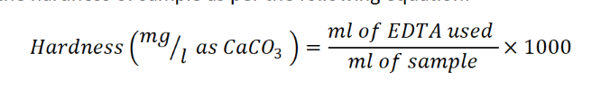

### Procedure

**Materials required**

Analytical balance  
Hot plate  
pH meter  
Burette  
Measuring cylinder  
Conical flask  
Water sample  
Ammonia buffer solution   
EBT indicator  
0.01 M EDTA standard solution  

**Methods**

1. Pipette out 25 ml water in a conical flask.
2. Add 1 ml ammonia buffer solution to adjust pH of around 10 of the sample.
3. Confirm the pH of water sample using pH meter.
4. Add 2-3 drops of EBT indicator in the sample conical flask.
5. Titrate the sample with 0.01M standard EDTA solution until the wine red color changes permanently into blue color
6. Record the volume of EDTA solution used for each titration.
7. Calculate the hardness of sample as per the following equation:

