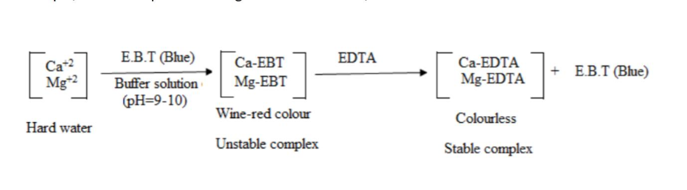

Water is an important ingredient used for drinking purpose and also in preparation of various food products. Quality of water plays important role in imparting desired properties to the processed products. Also, the drinking water is a good source of minerals but a limited amount is desired. The presence of different ions in water and their level affect the quality of water.

Water quality is analysed in different terms like hardness, chlorine content, chloride residue etc. Hardness of water is no specific constituent but is a variable and complex mixture of cations and anions. It is caused by dissolved polyvalent metallic ions. In fresh water, the principle hardness causing ions are calcium and magnesium. The other ions like Strontium, Iron, Barium and Manganese also contribute. Hardness is commonly expressed as CaCO3 in mg/L. The degree of hardness of drinking water has been classified in terms of the equivalent CaCO3 concentration as:
Soft: 0-60 mg/L; Medium: 60-120 mg/L; Hard: 120-180 mg/L and Very hard: > 180 mg/L

Ethylene diamine tetraacetic acid (EDTA) forms a stable complex with calcium or magnesium at pH 10. The metal ion indicator Eriochrome black T (EBT), are pink when complexed to metal ions but blue when no metal ions are complexed to them. The indicator binds to metal ions less strongly than does EDTA. When the indicator is added to a solution containing metal ions, the solution becomes pink. When EDTA is added as titrant to the mineral containing sample; metal ions preferentially complex with the EDTA while leaving the indicator without a metal ion to complex. When enough EDTA has been titrated to complex with all the metal ions present, the indicator appears blue. This blue color is the endpoint of the titration. The volume and concentration of the EDTA in the titration are used to calculate the concentration of calcium in the sample, which is expressed as mg calcium carbonate/L.

