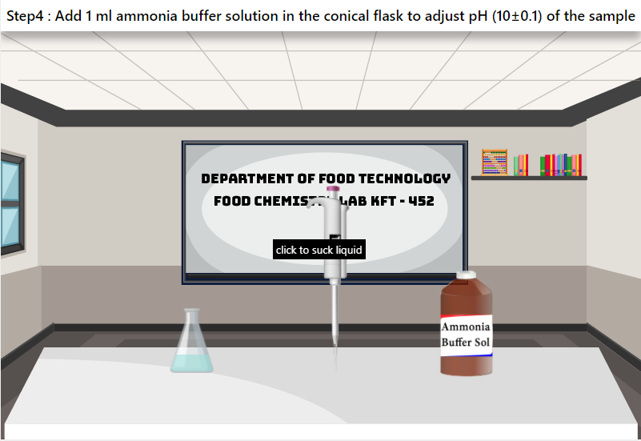

## Storyboard (Round 2)

Experiment 3: Analysis of water for potable and food purposes

### 1. Story Outline:

This experiment involves first of sample selection and the adjustment of its pH using ammonia buffer. Then confirm the pH using pH meter and after that addition of EBT indicator to it.  To complete the experiment, titration of the sample is desirable which starts with addition of EDTA standard solution to burette and continue till red color of sample solution changes to blue color completely. After that, volume of titrant used is recorded. Then on the basis of obtained data analysis of water in terms of hardness (mg/l CaCO3) is done. Then analysis of this data will give quality of water in terms of hardness.

The main objective of this experiment is to analyze water sample for potable and food purposes. During the operation student will be able to relate theoretical concept of sample preparation and understand new concepts as pH adjustment. User will able to apply concept of complexometric titration and analyze sample by titration process and determine hardness of water. Further based on the results, user will be able to estimate about quality of water.

### 2. Story:

First users will get themselves familiar with the experimental set-up and then take the desired of water sample for its further use. Then user will adjust pH to 10 by adding ammonia buffer. User will now with the help of pH meter confirm whether pH is adjusted or not. Once confirmed, now user will add 2-3 drops of EBT indicator in sample conical flask. User will fill the burette with standard EDTA solution and start titration of sample by opening knob of burette. User will observe the color change from red to blue and once it is completely blue color, user will stop the process by closing knob of burette. User will record the volume of titrant and use it for calculation. After calculation and results, user can analyze the data and predict the quality of water in terms of hardness.

#### 2.1 Set the Visual Stage Description:

In the simulator user will be able to see the virtual prototype of experimental set up resembling the actual experimental set up that is present in real time labs. For pH adjustment to 10, ammonia buffer is available. Then EBT is used as indicator. The titration set up EDTA standard solution in burette will be used to determine the end point by titrating water sample and titration is done to reach end point when red color of sample changes to blue color.

#### 2.2 Set User Objectives & Goals:

1.	The prime object of this experiment is to determine analyze heat stability of vitamin C.
2.	User will be able to relate the theoretical concept of sample preparation.
3.	User will be able to explain concept of pH adjustment.
4.	User will be able to apply the concept of complexometric titration.
5.	User will be able to analyze the sample by titration process.
6.	User will be able to determine hardness of water sample and estimate the quality of water.

#### 2.3 Set the Pathway Activities:

1.	User will get familiar with all experimental setups and materials/reagents used.
2.	For analysis, user will take 25 ml water in conical flask.
3.	User will add ammonia buffer solution to adjust pH 10.
4.	Simulator will display confirmation of pH using pH meter.
5.	After confirmation, user will addd EBT indicator to sample flask.
6.	User will place the sample conical flask under burette having standard EDTA solution and press ‘Open knob’ Tab of the burette.
7.	Simulator will display the titration process and change in color of sample as per step.
8.	Once titration is completed, user will press ‘Observation table’ and ‘Result & calculation’ Tab.
9.	Simulator will provide the result after calculation based on observed data.
10.	By analyzing result values of hardness, user will be able to predict about quality of water sample.

##### 2.4 Set Challenges and Questions/Complexity/Variations in Questions:

Difficulty level: Remember (LO1)

1.	The purpose of addition of ammonia solution in the sample is  
<b>a)	To adjust pH</b> 
b)	To dissolve calcium salt 
c)	Both (a) and (b) 
d)	None of the above 

Difficulty level: Understand (LO2)

2.	The optimum pH for the determination of hardness of water is  
a)	4±0.1 
b)	7±0.1 
<b>c)	10±0.1</b> 
d)	12±0.1 

Difficulty level: Apply (LO3)

3.	When EBT forms complex with calcium and magnesium ions, their color will be  
a)	Blue 
<b>b)	Red</b> 
c)	Black 
d)	Yellow 

Difficulty level: Analyze (LO4)

4.	Complexometric titrations are useful for the determination of 
<b>a)	metal ions in solution</b> 
b)	pH of solution 
c)	acidity of solution 
d)	solute matter in solution 

Difficulty level: Evaluate (LO5)

5.	Which of the following water has good quality in terms of hardness  
a)	Borewell water 
b)	Municipal water   
<b>c)	Treated water</b> 
d)	Sea water 

##### 2.5 Allow pitfalls:
During the titration step, user will be allowed to over titrate the sample by continuing addition of titrant after color change (that indicates end point of titration). The pitfall will show ‘Over-titrated’ and user is not able to move to next step and user has to go back to the step 1 of sample preparation and perform again.

##### 2.6 Conclusion:
User will take approximate 5-7 minutes for understanding the procedure. Then for generating data by the help of simulator will take 8-10 minutes. After onwards for calculating result will take 2-3 minutes. Hence, total time taken for doing experiment will be approximately 15-20 minutes.

##### 2.7 Equations/formulas: NA

### 3. Flowchart 4

 
 

### 4. Mindmap:

 
 

### 5. Storyboard :

